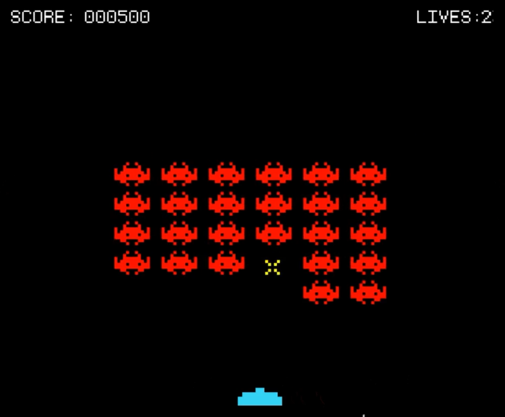
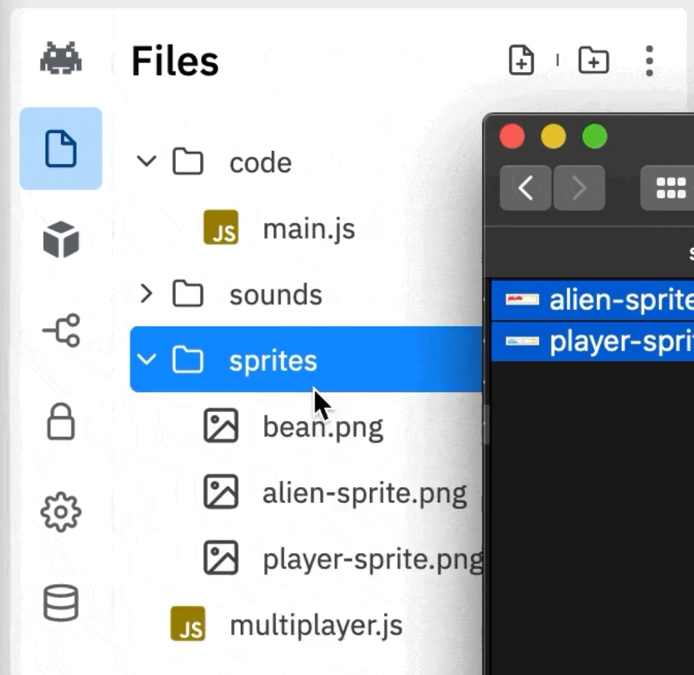
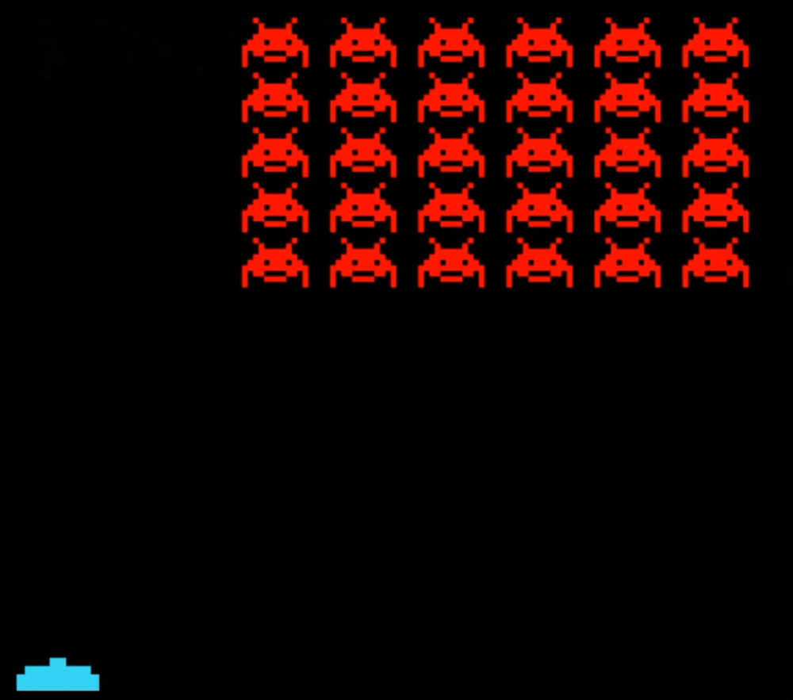
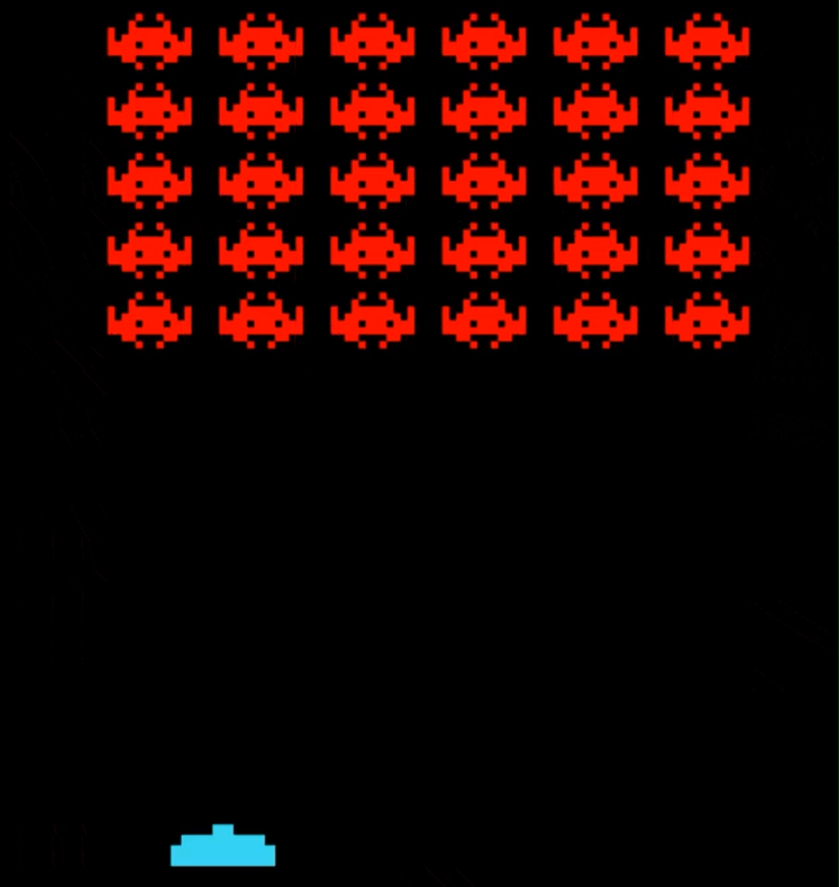
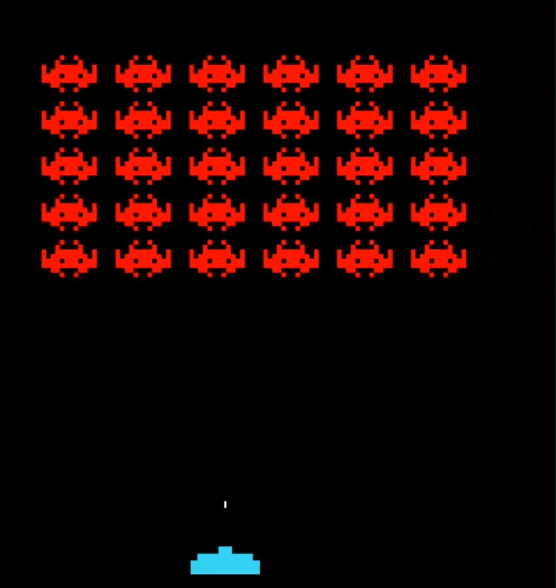
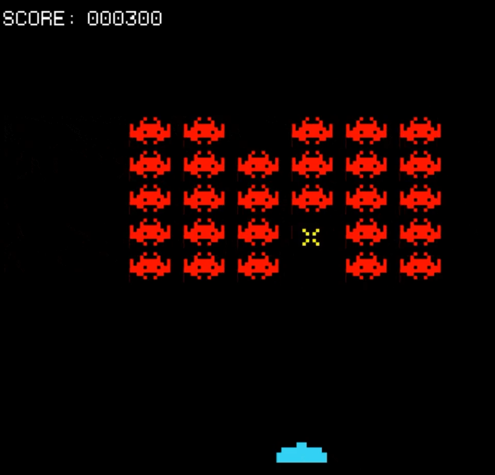
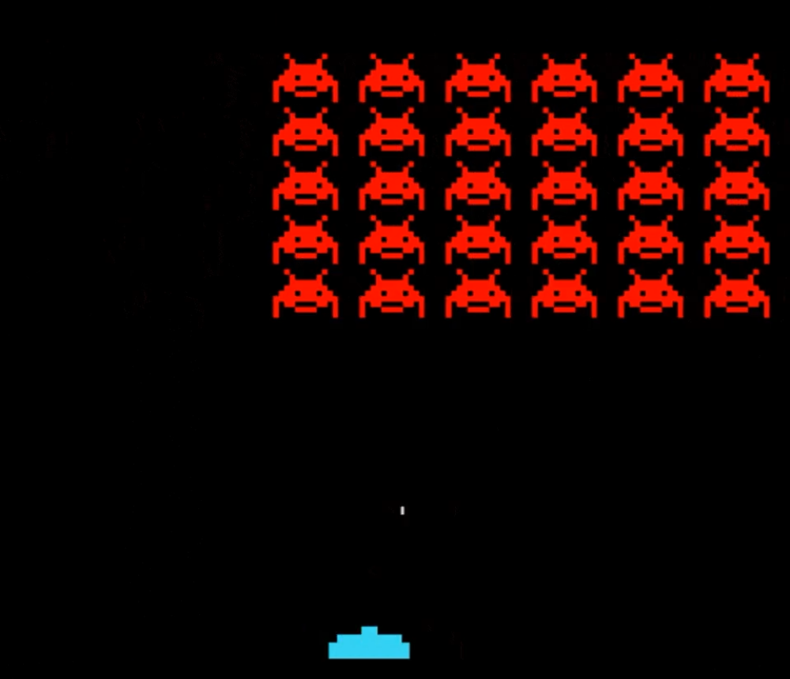

# Building *Space Invaders* with Kaboom

*Space Invaders* is a classic shoot 'em up arcade game created by Taito Corporation in Japan way back in 1978. It was an absolute monster hit, making nearly $4 billion in sales (that's the equivalent of over $13 billion today)!

Later, Atari released a clone of *Space Invaders* on the Atari 2600 home system. It was a great success, and meant that people could play *Space Invaders* on their home systems, instead of on an arcade machine. *Space Invaders* is pretty embedded in pop culture these days, and you might even find [*Space Invaders* mosaic and graffiti on the streets](https://theculturetrip.com/europe/france/paris/articles/everything-you-need-to-know-about-the-street-artist-invader/)!

Of course, *Space Invaders* was such a popular game, there were many clones and variations. Let's make our own version using [Kaboom](https://kaboomjs.com) and [Replit](https://replit.com).



## Designing the game

*Space Invaders* features alien enemies that move across the screen from one side to the other in a grid formation. The player moves left and right along the bottom of the screen and shoots at the aliens from below. Once the aliens reach the end of the screen, they move down one row and start moving in the opposite direction. In this way, the aliens get closer and closer to the player. Shooting an alien will destroy it and score points for the player. The aliens in the bottom row can shoot downwards towards the player. 

If the player gets shot, they lose a life. Players have three lives, and the game ends when they run out of lives.

When the aliens reach the bottom of the screen, the game is immediately over, as the alien invasion was a success! To win, the player has to destroy all the aliens before they reach the bottom of the screen. 


## Getting started 

Download [this archive of sprites and asset files](/tutorial-files/space-invaders-kaboom/space-invaders-resources.zip) we'll need for the game, and unzip them on your computer. In the Kaboom editor, click the "Files" icon in the sidebar. Now drag and drop all the sprite files (image files) into the "sprites" folder. Once they have uploaded, you can click on the "Kaboom" icon in the sidebar, and return to the "main" code file.




## Setting up Kaboom

First we need to initialize Kaboom. In the "main" code file, delete all the example code. Now we can add a reference to Kaboom, and initialize it:

```js
import kaboom from "kaboom";

kaboom({
  background: [0, 0, 0],
  width: 800,
  height: 600,
  scale: 1,
  debug: true

});

```

We initialize Kaboom with a black background (`[0, 0, 0]`), a width of 800 pixels, a height of 600 pixels, and a scale of 1. We also set `debug` to `true`, so we can access Kaboom diagnostics and info as we are developing. You can bring up the Kaboom debug info in the game by pressing "F1".

## Importing sprites and other game assets

Kaboom can import sprites in many different formats. We'll use the `.png` format, along with the Kaboom [`loadSpriteAtlas`](https://kaboomjs.com/#loadSpriteAtlas) function. This function allows us to tell Kaboom how to load a _sprite sheet_. A sprite sheet is an image with multiple frames of a sprite animation in it. We'll use sprite sheets for the aliens, so we can have a "move" animation when the aliens move, and an "explosion" animation for when the aliens are destroyed.

Similarly, we'll use a sprite sheet for the player's ship, so that we can animate an explosion when the player is destroyed.

This is what the two sprite sheets look like, for the aliens and the player:


We need to describe how to use each of the images in the sprite sheets. Kaboom's [`loadSpriteAtlas`](https://kaboomjs.com/#loadSpriteAtlas) function accepts an object describing all these details. Add the following code to the "main" code file:

```js
loadRoot("sprites/");
loadSpriteAtlas("alien-sprite.png", {
  "alien": {
    "x": 0,
    "y": 0,
    "width": 48,
    "height": 12,
    "sliceX": 4,
    "sliceY": 1,
    "anims": {
      "fly": { from: 0, to: 1, speed: 4, loop: true },
      "explode": { from: 2, to: 3, speed: 8, loop: true }
    }
  }
});

loadSpriteAtlas("player-sprite.png",{
  "player": {
    "x": 0,
    "y": 0,
    "width": 180,
    "height": 30,
    "sliceX": 3,
    "sliceY": 1,
    "anims": {
      "move": { from: 0, to: 0, speed: 4, loop: false },
      "explode": { from: 1, to: 2, speed: 8, loop: true }
    }
  }
});

```

The first call, `loadRoot`, tells Kaboom which directory to use as default for loading sprites – this is just easier than typing out the full root for each asset when we load it. 

Then we load the sprite sheets. The first argument is the path to the sprite sheet, and the second argument is an object describing how to use the sprite sheet. The object has a key for each sprite in the sprite sheet, and the value is another object describing how to use that sprite. Let's take a look at the keys we've used:
* `x` and `y` describe where the sprites start, by specifying the top left corner of the sprite.
* `width` and `height` describe the size of the sprite.
* `sliceX` and `sliceY` describe how many sprites are in each row and column of the sprite sheet. We have four separate sprites in the `x` direction in the alien file, and three in the player file.
* `anims` is an object that describes the animation for each sprite. Here we use the names of the animations for the keys, and the values are objects describing the animation.
* `from` and `to` describe the index of the first and last frames of the animation.
* `speed` is how many frames to show per second.
* `loop` is a boolean that tells Kaboom if the animation should loop, or only play once.

## Setting up scenes

[Scenes](https://kaboomjs.com/#scene) are like different stages in a Kaboom game. Generally, there are three scenes in games:

- The intro scene, which gives some info and instructions, and waits for the player to press "start".
- The main game, where we play.
- An endgame, or game over scene, which gives the player their score or overall result, and allows them to start again. 

For this tutorial, we'll omit the intro scene, since we already know what *Space Invaders* is and how to play it. You might like to add your own intro scene in later!


Let's add the code for defining each scene: 

```js
scene("game", () => {

	// todo.. add scene code here
});


scene("gameOver", (score) => {

	// todo.. add scene code here	
});


go("game")
```

Notice in the `"gameOver"` scene definition, we add a custom parameter: `score`. This is so we can pass the player's final score to the end game scene to display it. 

To start the whole game off, we use the [`go`](https://kaboomjs.com/#go) function, which switches between scenes. 

## Adding the player object

Now that we have the main structure and overhead functions out of the way, let's start adding in the characters that make up the *Space Invaders* world. In Kaboom, characters are anything that makes up the game world, including floor, platforms, and so on, not only the players and bots. They are also known as "game objects". 

Let's add in our player object. Add this code to the `"game"` scene:

```js
  const player = add([
    sprite("player"),
    scale(1),
    origin("center"),
    pos(50, 550),
    area(),
    {
      score: 0,
      lives: 3,
    },
    "player"
  ]);

  player.play('move');
```

This uses the [`add`](https://kaboomjs.com/#add) function to add a new character to the scene. The `add` function takes an array (`[ ]`) of components that make up the look and behavior of a game character. In Kaboom, every character is made up of one or more components. Components give special properties to each character. There are built-in components for many properties, like:
* [`sprite`](https://kaboomjs.com/#sprite), to give the character an avatar.
* [`pos`](https://kaboomjs.com/#pos), to specify the starting position of the object and give it functionality like movement.
* [`origin`](https://kaboomjs.com/#origin), to specify whether `pos` uses the object's center or one of the corners.
 
Kaboom also allows us to add custom properties to a game object. For the player, we add in their score and number of lives remaining as custom properties. This makes it simple to keep track of these variables without using global variables. 

We can also add a `tag` to the game objects. This is not too useful on the player object, but it will be very useful on the alien objects. The tag will allow us to select and manipulate a group of objects at once, like selecting and moving all aliens. 

## Adding the aliens

In *Space Invaders*, the aliens operate as a unit in a tightly formed grid. They all move in sync with each other. This is what that looks like: 


To create this grid, we could add each alien one at a time, but that would be a lot of code. Instead, we can use a [`for`](https://developer.mozilla.org/en-US/docs/Web/JavaScript/Reference/Statements/for) loop to cut down on the amount of code we need to write. We just need to decide how many rows and columns of aliens we want.

Let's create two constants for the number of rows and columns of aliens. Add this code to top of the "main" file:

```js
const ALIEN_ROWS = 5;
const ALIEN_COLS = 6;

```

We also need to specify the size of each "block" of the grid. Add these constants under the rows and columns we added above:

```js
const BLOCK_HEIGHT = 40;
const BLOCK_WIDTH = 32;
```

The last constants we need are to determine how far from the top and left side the alien block should start. Add these below the block-size constants:

```js
const OFFSET_X = 208;
const OFFSET_Y = 100;
```

Now we can use the [`for`](https://developer.mozilla.org/en-US/docs/Web/JavaScript/Reference/Statements/for) loop to add each alien. We'll use an _outer_  [`for`](https://developer.mozilla.org/en-US/docs/Web/JavaScript/Reference/Statements/for) loop to run through each row, and then we'll use an _inner_ [`for`](https://developer.mozilla.org/en-US/docs/Web/JavaScript/Reference/Statements/for) loop to add the aliens in columns, in this type of pattern:

```
  for each row       // Loop through each row
    for each column  // Loop through each column
      add alien      // Add an alien at position [row,column] 
```

We'll also keep a reference to each alien in a 2D array. This will be useful later, when we need to choose an alien to shoot at the player. 

Now, let's translate that to actual code. Add the following code to the `"game"` scene:

```js
  let alienMap = [];
  function spawnAliens() {
    for (let row = 0; row < ALIEN_ROWS; row++) {
      alienMap[row] = [];
      for (let col = 0; col < ALIEN_COLS; col++) {

        const x = (col * BLOCK_WIDTH * 2) + OFFSET_X;
        const y = (row * BLOCK_HEIGHT) + OFFSET_Y;
        const alien = add([
          pos(x, y),
          sprite("alien"),
          area(),
          scale(4),
          origin("center"),
          "alien",
          {
            row: row,
            col: col
          }
        ]);
        alien.play("fly");
        alienMap[row][col] = alien;
      }
    }
  }
  spawnAliens();
```

This code adds the function `spawnAliens` to the `"game"` scene. We implement the double for loop in the function, and add the aliens to the scene.

We use the constants we defined earlier to calculate where to add each alien. We also add a custom property to each alien called `row` and `col`. This is so we can easily access which row and column the alien is in when we query it later. Our 2D array, `alienMap`, is where we store a reference to each alien at indices `row` and `col`. There is some code to initialise each row of the array after the first for loop. 

We also call `alien.play("fly")`, which tells Kaboom to run the `"fly"` animation on the alien. If you look at the `loadSpriteAtlas` call for the `alien` sprite, you'll see that it defines the `"fly"` animation, which switches between the first two frames of the sprite sheet. 

Then we call the `spawnAliens` function to add the aliens to the scene.

If you run the game, you should see a block of animated aliens and the blue player block at the bottom of the screen, like this:




## Moving the player

The next step is adding controls to move the player around the screen. Kaboom has the useful [`onKeyDown`](https://kaboomjs.com/#onKeyDown) function that we can use to call a handler when specified keys are pressed. When we added the [`pos`](https://kaboomjs.com/#pos) component to our player, it added methods to [`move`](https://kaboomjs.com/#move) the player. We'll use these functions to add this move-handling code to the `"game"` scene:

```js
  let pause = false;
  onKeyDown("left", () => {
    if (pause) return;
    if (player.pos.x >= SCREEN_EDGE) {
      player.move(-1 * PLAYER_MOVE_SPEED, 0)
    }
  });

  onKeyDown("right", () => {
    if (pause) return;
    if (player.pos.x <= width() - SCREEN_EDGE) {
      player.move(PLAYER_MOVE_SPEED, 0)
    }
  });
```

You'll notice that we use two constants:
- `SCREEN_EDGE`, which provides a margin before the player gets right to the edge of the screen, and
- `PLAYER_MOVE_SPEED`, which is the speed at which the player moves.

Add the two constants at the top of the "main" file, along with the other constants:

```js
const PLAYER_MOVE_SPEED = 500;
const SCREEN_EDGE = 100;
```

You'll also notice that we have a `pause` variable. We'll use this later on to prevent the player from moving when they have been shot. 

If you run the game now, you'll be able to move the player left and right on the screen. 



## Moving the aliens

The next step is to make the aliens move. In *Space Invaders*, the aliens move from one side of the screen to the other. When they reach either end of the screen, they move down a row, and start moving in the opposite direction. 

For this, we'll need a few flags to determine where we are in the sequence. Add these to the `"game"` scene:

```js
let alienDirection = 1;
let alienMoveCounter = 0;
let alienRowsMoved = 0; 
```

We use `alienDirection` as a flag that can be either 1 or -1. It controls if the aliens move left or right. We use `alienMoveCounter` to track how many places the aliens have moved over in the current direction. When this counter reaches a certain value, we'll switch the alien direction and move them all down a row. We use `alienRowsMoved` to track how many rows down the aliens have moved. When they have moved down a certain number of rows and reach the ground, we'll end the game. 

We'll also need a few constants that hold the speed the aliens should move at, how many columns the aliens should move before switching directions, and how many rows the aliens can move before reaching the ground. Add these along with the other constants:

```js
const ALIEN_SPEED = 15;
const ALIEN_STEPS = 322;
const ALIEN_ROWS_MOVE = 7;
```

Since the aliens should move automatically, without the player pressing a key, we need a way to call our code to move the aliens every frame. Kaboom has a function [`onUpdate`](https://kaboomjs.com/#onUpdate) that we can use. Add the following code to the `"game"` scene:

```js
 onUpdate(() => {
    if (pause) return; 
    
    every("alien", (alien) => {
      alien.move(alienDirection * ALIEN_SPEED, 0);
    });

    alienMoveCounter++;

    if (alienMoveCounter > ALIEN_STEPS) {
      alienDirection = alienDirection * -1;
      alienMoveCounter = 0;
      moveAliensDown();
    }

    if (alienRowsMoved > ALIEN_ROWS_MOVE) {
      pause = true; 
      player.play('explode');
      wait(2, () => {
        go("gameOver", player.score);
      });
    }
  });

  function moveAliensDown() {
    alienRowsMoved ++; 
    every("alien", (alien) => {
      alien.moveBy(0, BLOCK_HEIGHT);
    });
  }

```
This code has a number of parts. First, we check if the game is in the pause state. If it is, we don't want to do anything, so we return early. Then we use the Kaboom [`every`](https://kaboomjs.com/#every) function, which selects game objects with a given tag, and runs the given function on each one. In this case, we're selecting all aliens and using [`move`](https://kaboomjs.com/#move) to move them across the screen, at the speed and direction specified by our direction flag. 

Then we update the `alienMoveCounter` and check if it has reached the value of `ALIEN_STEPS`. If it has, we switch the direction of the aliens and reset the counter. We also call a helper function `moveAliensDown` to move the aliens down a row. Note that in the `moveAliensDown` function, we also select all aliens using the [`every`](https://kaboomjs.com/#every) function. This time, we make use of the `moveBy` function, which moves the aliens by a given amount. The difference between the [`move`](https://kaboomjs.com/#move) and `moveBy` functions is that `move` parameters specify pixels per second, while `moveBy` specifies the total number of pixels to move by. 

Finally, we check if the aliens have moved down more than `ALIEN_ROWS_MOVE`. If they have, we end the game. When the game ends, we change the player sprite to play the `explode` animation, which plays the last two frames of the sprite sheet. We also wait for two seconds before calling the `go` function to go to the `"gameOver"` scene, passing in the player's score so it can be shown to the player.

## Firing bullets

Now our game characters can all move around. Let's add in some shooting. In *Space Invaders*, the player shoots up to the aliens. There should be a "reload" time between shots, so that the player can't just hold down the fire button and machine-gun all the aliens. That would make the game too easy, and therefore boring. To counter that, we'll need to keep track of when the last bullet was fired and implement a short "cooldown" period before the player can shoot again. We'll use the [`onKeyDown`](https://kaboomjs.com/#onKeyDown) function to connect pressing the space bar to our shooting code. Add the following code to the `"game"` scene:

```js
  let lastShootTime = time();

  onKeyPress("space", () => {
    if (pause) return; 
    if (time() - lastShootTime > GUN_COOLDOWN_TIME) {
      lastShootTime = time();
      spawnBullet(player.pos, -1, "bullet");
    }
  });

 function spawnBullet(bulletPos, direction, tag) {
    add([
      rect(2, 6),
      pos(bulletPos),
      origin("center"),
      color(255, 255, 255),
      area(),
      cleanup(),
      "missile",
      tag,
      {
        direction
      }
    ]);
  }

```

You'll see in the code above that we have a helper function, `spawnBullet`, that handles creating a bullet. It has some parameters, like the starting position of the bullet `bulletPos`, the direction it should move in `direction`, and the tag to give the bullet. The reason this is in a separate function is so that we can re-use it for the aliens' bullets when we make them shoot. Notice that we use Kaboom's [`cleanup`](https://kaboomjs.com/#cleanup) component to automatically remove the bullet when it leaves the screen. That is super useful, because once a bullet leaves the screen, we don't want Kaboom spending resources updating it every frame. With hundreds of bullets on the screen, this can be a performance killer.

We also use the constant `GUN_COOLDOWN_TIME` to test if the player can shoot again. This is the time in seconds between shots. Add this constant to the other constants we have used:

```js
const GUN_COOLDOWN_TIME = 1;
```

To check the gun cooldown time, we use the Kaboom [`time`](https://kaboomjs.com/#time) function. The `time` function returns the time since the game started in seconds. Whenever the player shoots, we record the time in `lastShootTime`. Then, each time the player presses the space bar, we check if the time since the last shot is greater than `GUN_COOLDOWN_TIME`. If it is, we can shoot again. If it isn't, we can't shoot again. This way we can make sure the player needs to smash the fire button to get a rapid fire.

The code above handles the player pressing the fire button, the space bar, and spawning a bullet. This bullet will just be stationary until we add in some movement for it each frame. We've given each bullet spawned a tag called `missile` so that we'll be able to select it later. We also added a custom property `direction` to the bullet. Using those properties, we can move the bullet in the direction it should move using this code:

```js
  onUpdate("missile", (missile) => {
    if (pause) return; 
    missile.move(0, BULLET_SPEED * missile.direction);
  });
```

The [`onUpdate`](https://kaboomjs.com/#onUpdate) function has an option to take a tag to select the game objects to update each frame. In this case, we're updating all bullets. We also have a constant `BULLET_SPEED` that specifies the speed of the bullets. Add this constant to the other constants:

```js
const BULLET_SPEED = 300;
```

If you run the game now, you should be able to shoot bullets. They won't kill the aliens yet. We'll add that next. 




## Detecting bullet collisions with aliens

Now that we have bullets and they move, we need to add collision detection and handling code to check when the bullet hits an alien. For this, we can use the Kaboom [`onCollide`](https://kaboomjs.com/#onCollide) function. First add the constant below to the other constants:

```js
const POINTS_PER_ALIEN = 100;
```

Then add the following code to the `"game"` scene:

```js
  onCollide("bullet", "alien", (bullet, alien) => {
    destroy(bullet);
    alien.play('explode');
    alien.use(lifespan(0.5, { fade: 0.1 }));
    alienMap[alien.row][alien.col] = null; // Mark the alien as dead
    updateScore(POINTS_PER_ALIEN);
  });
```

In this function, we pass the tags for the `bullet` and `alien` in to `onCollide`, so that our handler is fired whenever these two types of objects collide on the screen. First we call Kaboom's [`destroy`](https://kaboomjs.com/#destroy) function to destroy the bullet on the screen. Then we call the `play` function on the alien to play the `explode` animation. We also use the [`lifespan`](https://kaboomjs.com/#lifespan) function to make the alien fade out and disappear after a short period of time. Finally, we mark the alien as dead in the `alienMap` array, by setting its entry to null. This way, we can keep tabs on which aliens are still alive when we choose an alien to shoot back at the player. 

Finally, we call a helper method `updateScore` to add to the player's score, and update it on screen. We need a bit of code to get this part working - including adding text elements to the screen to show the score. Add the following code to the `"game"` scene:

```js
  add([
    text("SCORE:", { size: 20, font: "sink" }),
    pos(100, 40),
    origin("center"),
    layer("ui"),
  ]);

  const scoreText = add([
    text("000000", { size: 20, font: "sink" }),
    pos(200, 40),
    origin("center"),
    layer("ui"),
  ]);

  function updateScore(points) {
    player.score += points;
    scoreText.text = player.score.toString().padStart(6, "0");
  }
```

First we add a text label for the score. We use the Kaboom [`text`](https://kaboomjs.com/#text) component to create a text element. Then we need a text element that shows the actual score. We add it the same way as the label, except this time we store a reference to this text element in `scoreText`. Then we have the helper function `updateScore`, which adds points to the player's score and updates the score text element. We use the `padStart` function to add leading zeros to the score, so that the score is always six digits long. This shows the player that it is possible to score a lot of points!

If you run the game now, you should be able to shoot at an alien, destroy it, and see your points increase. 




## Making the aliens shoot back

It's not fair that only the player can shoot the aliens - we've got to give the aliens a chance to shoot back! Since we don't want the aliens to be shooting each other, we need to only allow aliens with a clear shot to the ground to be able to shoot. In other words, an alien that shoots must not have another alien in front of them. Recall that when we added the aliens, we created a 2D array that stores a reference to each alien. When an alien gets hit, we set the entry in the array to null. Therefore we can use this array to find an alien that has a clear shot to the ground to shoot at the player. 

To make the aliens shoot at regular intervals, we'll use the Kaboom [`loop`](https://kaboomjs.com/#loop) function, which calls a function at a regular interval. Add the following code to the `"game"` scene:

```js
  // Find a random alien to make shoot
  loop(1, () => {

    if (pause) return; 
    // Randomly choose a column, then walk up from the
    // bottom row until an alien that is still alive is found

    let row, col;
    col = randi(0, ALIEN_COLS);
    let shooter = null;

    // Look for the first alien in the column that is still alive
    for (row = ALIEN_ROWS - 1; row >= 0; row--) {
      shooter = alienMap[row][col];
      if (shooter != null) {
        break;
      }
    }
    if (shooter != null) {
      spawnBullet(shooter.pos, 1, "alienBullet");
    }

  });
```
First, we check if we are in a paused state - if so, we get out early. If not, our task is to randomly choose an alien that has a clear shot at the ground. To do this, we use this logic:

- Choose a random column in the alien map.
- Walk up the rows from the bottom until we find an alien that is still alive.
- If we find an alien, we can use it as the shooter.
- If we successfully find a shooter, spawn a bullet at the shooter's position, and tag it as an alien bullet.

This way, there is no pattern that the player can learn to outsmart the aliens.

If you run the game now, you should see a random alien shoot at the player every second.




## Detecting bullet collisions with the player

Now that the aliens can shoot, we can add code to determine if one of their bullets hit the player. To do this, we can use the Kaboom [`onCollide`](https://kaboomjs.com/#onCollide) function again. Add the following code to the `"game"` scene:

```js
  player.onCollide("alienBullet", (bullet) => {
    if (pause) return; 
    destroyAll("bullet");
    player.play('explode');
    updateLives(-1);
    pause = true; 
    wait(2, () => {
      if (player.lives == 0){
        go("gameOver", player.score);
      }
      else {
        player.moveTo(50, 550);
        player.play('move');
        pause = false;
      }
    });
  });
```

This code is similar to the previous collision handler we added for bullets hitting aliens. There are a few difference though. 

First, we check if the game is in the pause state, and exit early from the function if it is. If not, then we destroy the bullet, as we don't want to display it anymore (it's stuck in the player!). Next, we use the `play` method to change the player sprite to the `explode` animation we defined in the `loadSpriteAtlas` call. We have a helper method, `updateLives`, similar to the one we used to update the score. We set the the `pause` flag to true to prevent the player or aliens from moving or shooting. After two seconds, using the [`wait`](https://kaboomjs.com/#wait) function, we either go to the end game screen (if the player has no more lives left) or reset the player to the start position (if the player still has lives) to allow the game to continue. Once the player has been reset, we set the `pause` flag to false and switch the player sprite back to the `move` animation.

The `updateLives` helper function needs a few UI elements, as we did for the score. Add the following code to add the lives text elements to the `"game"` scene:


```js
  add([
    text("LIVES:", { size: 20, font: "sink" }),
    pos(650, 40),
    origin("center"),
    layer("ui"),
  ]);

  const livesText = add([
    text("3", { size: 20, font: "sink" }),
    pos(700, 40),
    origin("center"),
    layer("ui"),
  ]);

  function updateLives(life) {
    player.lives += life;
    livesText.text = player.lives.toString();
  }
```

This code follows the same pattern as the score UI elements, so we won't go into details here. 

We made a call to the `"gameOver"` scene. At the moment, we just have a placeholder comment there. Let's add the code we need to show the final score and add the logic to start a new game. Add the following code to the `"gameOver"` scene:

```js
  add([
    text("GAME OVER", { size: 40, font: "sink" }),
    pos(width() / 2, height() / 2),
    origin("center"),
    layer("ui"),
  ]);

  add([
    text("SCORE: " + score, { size: 20, font: "sink" }),
    pos(width() / 2, height() / 2 + 50),
    origin("center"),
    layer("ui"),
  ])

  onKeyPress("space", () => {
    go("game");
  });
```

In the `"gameOver"` scene, we add a big, size 40 "Game Over" banner. The score is added below it, in smaller text. We also add a way to start a new game. We use the [`onKeyPress`](https://kaboomjs.com/#onKeyPress) function to listen for the space bar being pressed. When this happens, we call the `go` function to start the game again.

All the elements for the game are now defined. Give it a go, and see how you do!

## Things to try

You can find the code for this tutorial on [Replit](https://replit.com/@ritza/Space-Invaders).

Here are some things to try to make this game more entertaining:

- make the aliens move or shoot faster for each level the player reaches
- add some sound effects and music. Kaboom has the [`play`](https://kaboomjs.com/#play) function to play audio files. Try adding effects for shooting, explosions, points scored, etc
- add different types of aliens. In many *Space Invaders* versions, a "boss" ship flies across the top of the screen at random intervals. Shooting this ship gives the player lots of bonus points
-give the player a bonus life if they reach a certain score
